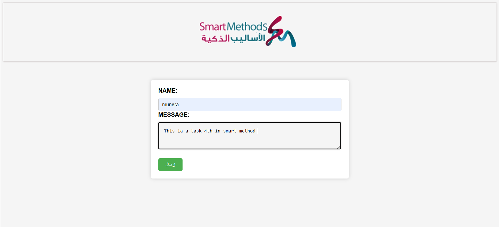

# post-data
**This a task 4th is a part of the summer training at the Smart Methods Company.**
--------------------------------------
**Task 4:**
--------------------------------------
"get-post-data" this code represent to allows information to be submitted and stored in a MySQL database. The submitted data can also be viewed.
--------------------------------------

